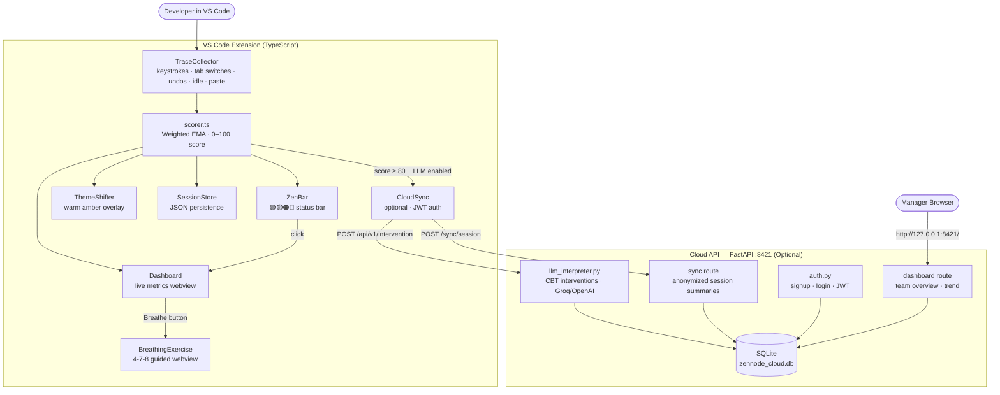

<p align="center">
  <strong>Stop burnout before it starts. Code with clarity, not exhaustion.</strong><br>
  Real-time cognitive load monitoring for VS Code — protecting developer mental health with behavioral science and AI.
</p>

<p align="center">
  
  
  
  
  
  
  
</p>

<p align="center">
  <a href="https://ryadavtmc.github.io/zen-node/"><strong>🌐 Live Demo → ryadavtmc.github.io/zen-node</strong></a>
</p>

---

> *"We spend billions building tools that monitor the health of servers, databases, and APIs. ZenNode asks a simple question: what if we monitored the health of the developer too? Not with surveys. Not with annual check-ins. But in real-time, inside the tool they use 8 hours a day, using the behavioral signals their brain is already broadcasting. Because the most expensive bug in production isn't a null pointer — it's a burned-out developer who stopped caring enough to catch it."*

---

## 🔒 Privacy Is the Foundation

> **ZenNode was designed privacy-first from day one — not as a checkbox, but as a core principle.**

Mental health tooling only works if developers *trust* it. The moment an employee suspects their IDE is reporting their struggle to a manager, they'll hide the struggle. ZenNode is architected so that trust is not a matter of policy — it's guaranteed by the code itself.

| Guarantee | How It's Enforced |
|---|---|
| **Scoring runs 100% locally** | The TypeScript scorer (`src/scorer.ts`) runs inside the extension process — no data leaves your machine for cognitive scoring |
| **Counts only, never content** | `traceCollector.ts` records *how many* keystrokes, never *what* you typed. File names, variable names, and source code are never accessed |
| **LLM sees metadata, not code** | If Layer B (optional cloud) is enabled, the AI receives only anonymized behavioral numbers: e.g., `"tabSwitches: 18, undos: 12"` — never source code |
| **Team sync is opt-in and anonymized** | Cloud sync only activates after you choose to connect. Only aggregated session summaries are shared, identified by a random `anonymous_id` — never your name or email |
| **No telemetry, ever** | ZenNode has no analytics, no crash reporting, no phone-home. It cannot phone home because it has no such code |
| **Local session storage** | Sessions are stored in VS Code's global storage as JSON — fully under your control, never uploaded without consent |
| **You can audit it** | The entire codebase is open source. Every privacy claim above can be verified line-by-line |

---

## 🔥 The Problem

Software developers are in the middle of a **mental health epidemic** — and their tools are blind to it.

- **58% of developers** report burnout symptoms (Haystack Analytics 2025)
- **73% feel mentally exhausted** by end of day — up from 42% pre-AI era
- **42% who left tech** in 2025 cited mental health as the primary reason
- The WHO now classifies **occupational burnout as a medical syndrome** (ICD-11)

In 2026, AI-assisted coding made developers 10x faster at *producing* code — but the human brain still reviews at the same speed. The bottleneck shifted from writing to **sustaining the mental energy** to review, verify, and reason about a flood of AI-generated code.

**Your IDE knows if your code has a bug. It has no idea if *you* are about to break.**

---

## 💡 What It Does

Real-time cognitive load monitoring for VS Code. Tracks your behavioral signals (keystrokes, tab switches, undo rate, idle time) and tells you when your brain is overloaded — before burnout sets in.

Scoring runs **100% locally** in TypeScript. The cloud backend is optional and only adds LLM interventions + team sync.

---

## What It Does

| State | Score | Zen Bar | Meaning |
|---|---|---|---|
| Flow | 0–30 | 🟢 | Deep focus. ZenNode stays invisible. |
| Friction | 31–60 | 🟡 | Working hard but managing. |
| Fatigue | 61–80 | 🟠 | Brain is tiring. Gentle nudges begin. |
| Overload | 81–100 | 🔴 | Full intervention. Amber theme + notification. |

---

## Setup

**Requirements:** VS Code ≥ 1.85 · Node.js ≥ 18 · Python ≥ 3.10 (cloud only)

### 1. Extension (required)

```bash
git clone https://github.com/ryadavtmc/zen-node.git
cd zen-node
npm install
npm run compile
```

Then either:

- **Dev mode:**  
  Press `F5` in VS Code → Extension Development Host launches

- **Install VSIX (CLI):**  
  `vsce package` → `code --install-extension zennode-0.1.0.vsix`

- **Install VSIX (via VS Code UI):**
  - Open VS Code
  - Go to Extensions (`Ctrl+Shift+X`)
  - Click the `...` menu (top right)
  - Select **Install from VSIX...**
  - Choose your `.vsix` file

- **If `vsce` command is not found:**
  - Install it with: `npm install -g vsce`

The Zen Bar appears in the status bar: ** ZenNode: Flow (0) 🟢**


---

### 2. Cloud Backend (optional)

The cloud adds LLM-powered interventions and a manager team dashboard.

```bash
cd cloud
python3 -m venv .venv
source .venv/bin/activate        # Windows: .venv\Scripts\activate
pip install -r requirements.txt
```

Create a `cloud/.env` file:

```env
SECRET_KEY=your-secret-key
LLM_API_KEY=your-groq-or-openai-key
LLM_BASE_URL=https://api.groq.com/openai/v1
LLM_MODEL=llama-3.3-70b-versatile
LLM_ENABLED=true
JWT_EXPIRE_MINUTES=10080
```

Start the server:

```bash
uvicorn main:app --host 127.0.0.1 --port 8421 --reload
```

Verify: `curl http://127.0.0.1:8421/health`
API docs: `http://127.0.0.1:8421/docs`

---

### 3. Connect Extension to Cloud

1. In VS Code: `Cmd+Shift+P` → **ZenNode: Connect to Team**
2. Sign up or log in with your account
3. Create or join a team using the invite code
4. Enable LLM in VS Code settings: set `zennode.enableLLM` to `true`

**Demo developer account (for testing):**

| Field | Value |
|---|---|
| Email | `alex@gmail.com` |
| Password | `Lion@14321` |
| Team invite code | `ZEN-DEMO01` |

---

### 4. Manager Dashboard

Open `http://127.0.0.1:8421/` in your browser and log in with your manager account.

**Demo credentials (for testing):**

| Field | Value |
|---|---|
| Email | `manager@zennode.dev` |
| Password | `password123` |

To create your own manager account:
1. Sign up at `POST /auth/signup`
2. Create a team at `POST /teams/create` — you become the manager automatically
3. Share the invite code with your developers

---

## Commands

Open the Command Palette (`Cmd+Shift+P` / `Ctrl+Shift+P`):

| Command | Description |
|---|---|
| `ZenNode: Show Cognitive Dashboard` | Open the live metrics dashboard |
| `ZenNode: Breathing Exercise` | Launch guided 4-7-8 breathing |
| `ZenNode: Reset Session` | Archive current session + sync to cloud |
| `ZenNode: Toggle Tracking` | Pause/resume monitoring |
| `ZenNode: Connect to Team` | Connect to cloud and join a team |
| `ZenNode: Disconnect from Team` | Disconnect from cloud |

---

## Settings

All settings are under `zennode.*` in VS Code settings (`Cmd+,`):

| Setting | Default | Description |
|---|---|---|
| `zennode.enabled` | `true` | Enable/disable monitoring |
| `zennode.sampleIntervalMs` | `5000` | How often (ms) to collect a snapshot |
| `zennode.enableThemeShift` | `true` | Shift editor to warm amber at high load |
| `zennode.enableLLM` | `false` | Enable LLM interventions (requires cloud) |
| `zennode.warningThreshold` | `50` | Score that triggers yellow warning |
| `zennode.criticalThreshold` | `80` | Score that triggers red alert |
| `zennode.showNotifications` | `true` | Show notification popups |

---

## Cloud API Endpoints

Interactive API docs (Swagger UI): **`http://127.0.0.1:8421/docs`**

| Method | Endpoint | Description |
|---|---|---|
| `POST` | `/auth/signup` | Create account |
| `POST` | `/auth/login` | Login, get JWT |
| `GET` | `/auth/me` | Current user info |
| `POST` | `/teams/create` | Create team (you become manager) |
| `POST` | `/teams/join` | Join team via invite code |
| `GET` | `/teams/members` | List team members (manager only) |
| `POST` | `/sync/session` | Push session summary |
| `GET` | `/dashboard/team` | Team overview (manager only) |
| `POST` | `/api/v1/intervention` | Get LLM message at overload |

---

## Troubleshooting

| Problem | Fix |
|---|---|
| Port 8421 already in use | `lsof -i :8421` → `kill <PID>` |
| `ModuleNotFoundError` | Activate venv: `source cloud/.venv/bin/activate` |
| LLM not triggering | Check `cloud/.env` has `LLM_ENABLED=true` and set `zennode.enableLLM: true` in VS Code settings |
| No overload notifications | Make sure you're actively typing in a VS Code editor (terminal/browser activity is not tracked) |
| Manager dashboard empty | Developer must reset session (`ZenNode: Reset Session`) or wait ~50s for auto-sync |

---

## Architecture



---

## Project Structure

```
zen-node/
├── src/                    VS Code Extension (TypeScript)
│   ├── extension.ts        Main activation + 5s loop
│   ├── traceCollector.ts   Behavioral signal tracking
│   ├── scorer.ts           Local cognitive scoring (Layer A)
│   ├── sessionStore.ts     Session persistence (JSON)
│   ├── zenBar.ts           Status bar indicator
│   ├── themeShifter.ts     Warm amber theme overlay
│   ├── dashboard.ts        Live metrics webview
│   ├── breathingExercise.ts  Guided breathing webview
│   ├── cloudSync.ts        Cloud sync (optional)
│   └── connectWizard.ts    Team connect wizard
│
├── cloud/                  Cloud API (FastAPI, optional)
│   ├── main.py             App entry point
│   ├── auth.py             JWT auth
│   ├── database.py         SQLite via SQLAlchemy
│   ├── models.py           DB models
│   ├── schemas.py          Pydantic schemas
│   ├── routes/             API route handlers
│   └── requirements.txt    Python dependencies
│
└── package.json            Extension manifest
```

---

## Technologies Used

| Layer | Technology | Purpose |
|---|---|---|
| VS Code Extension | TypeScript | Behavioral signal collection, local scoring, UI |
| Local Scorer | Pure TypeScript math | Weighted EMA cognitive load algorithm — zero dependencies |
| Cloud API | FastAPI + Uvicorn | LLM interventions, auth, team health, session sync |
| Database | SQLite + SQLAlchemy | Session persistence and cloud team data |
| LLM Integration | OpenAI-compatible API | Groq (default), OpenAI, or Ollama for CBT interventions |
| Auth | JWT (python-jose) + bcrypt | Secure developer accounts and team access |
| Data Validation | Pydantic v2 | Shared schemas between extension and backend |
| Extension Packaging | @vscode/vsce | Build and distribute `.vsix` packages |

---

## Team

| Name | Role |
|---|---|
| Ravi Yadav | Developer |
| Himanshu Jha | Developer |

---

## Privacy

- Scoring runs **100% locally** — no data leaves your machine
- Tracks **counts only** (keystrokes, tab switches, undos) — never what you typed
- LLM sees **behavioral numbers only** — never your source code
- Team sync is **opt-in and anonymized** — random `anonymous_id`, no names or emails
- No telemetry, no analytics, fully open source

---

MIT License · Built for the Nepal US Hackathon 2026
